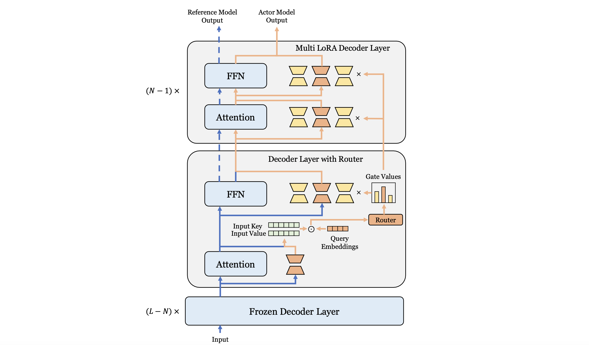

# AdRE: Adapter Reinforcement Learning Framework

## News 🔥
[2025/07/14] Make the repository open source！
## Introduction

AdRE is a LoRA Adapter reinforcement learning (RL) framework designed for large language models (LLMs) and supports multi-expert (Multi-LoRA-Expert) architecture. It supports reinforcement learning training (such as GRPO) and Adapter-based efficient fine-tuning (SFT). This framework is suitable for research and practical application scenarios such as RLHF and efficient LLM adaptation.


## Main Features




 **Multi-LoRA Architecture**

- Supports a **Multi-LoRA** architecture with three components:
    1. **Frozen layers**: not trainable.
    2. **Routing layers**: dynamic MoE-style routing based on attention.
    3. **Multi-LoRA layers**: trainable layers composed of multiple LoRA experts.


**LoRA SFT (Supervised Fine-tuning)**

- Enables efficient multi-GPU fine-tuning for **LoRA** and **Multi-LoRA** using **data parallelism**.


**Reinforcement Learning (RL)**

- Supports **LoRA-based RL fine-tuning** based on **GRPO**, with multi-GPU data parallelism.
- Built-in support for:
    - **Reward modeling**
    - **Experience collection**
    - **Temperature scheduling**
- Requires only a **single model with LoRA adapters** (no separate reference model needed), significantly reducing GPU memory usage.
- Supports **layer freezing** and **shared computation** between the reference and actor models to save resources.


```
@misc{adre_2025,
  author       = {Mengqi Liao},
  title        = {AdRE: Adapter Reinforcement Learning Framework},
  howpublished = {\url{https://github.com/LiaoMengqi/AdRE}},
  year         = {2025},
  note         = {GitHub repository}
}
```


## Acknowledgements

This project is inspired by and references the excellent work of [OpenRLHF](https://github.com/OpenRLHF/OpenRLHF) and [VeRL](https://github.com/volcengine/verl). Sincere thanks to their open-source contributions to the community.